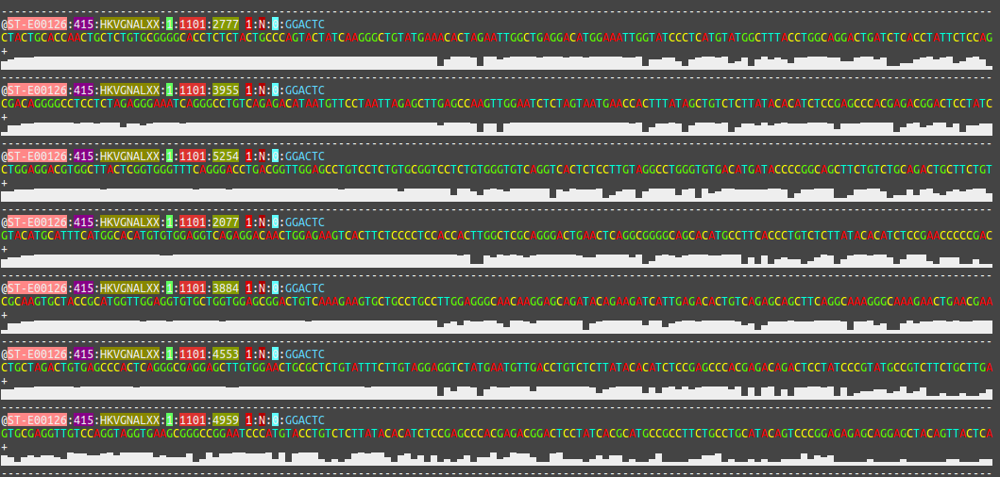
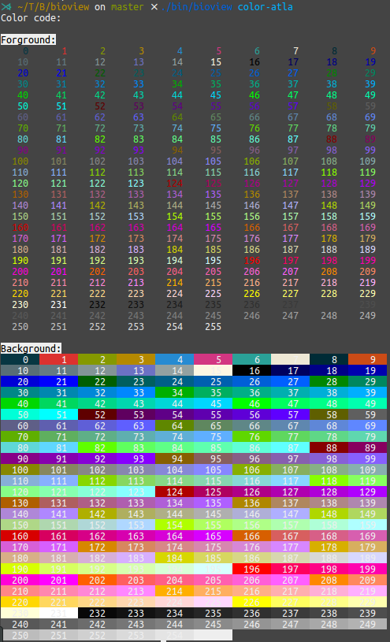

# bioView

A configurable and easy install command line tool for the readability enhancement of bioinformatic file format: fasta, fastq and sam file.



## Installation

This tools is writen in Nim, it can be compiled to a single excutable file.
So, it is very easy to install, just download the release excutable file, and add it to your PATH.

## Usage

``` bash
$ bioview fq example.fq | less -S
```

## Theme

Provide different themes you can choise.

### simple (default)

### verbose

### emoji

[see more](./theme/README.md).

## Make your own theme

You can make your own theme through the config file.

Just generate the config templete, and edit it:

``` bash
$ mkdir -p ~/.config/bioview/config.json
$ bioview example-config > ~/.config/bioview/config.json
$ vim ~/.config/bioview/config.json
```

### Color

The `color` fields used to specify the color of related item, for example the `base color` denote the color of base(ATCG),
and the `fq_config::hist::color` denote the color of histogram in the fastq view. The `fg` and `bg` field means the color
code of the forground color and the background color. You can query the color code through the command:

``` bash
$ bioview color-atla
```

It will list all supported forground color and background color. like:



And use the code `-1` denote the "non-color".

### Histogram

The `fq_config::hist` and `sam_config::hist` fields used to specify the color and symbols of the histogram.

default histogram symbols:
```
▁▁▁▁▁▁▁▁▂▂▂▂▂▃▃▃▃▃▄▄▄▄▄▅▅▅▅▅▆▆▆▆▆▇▇▇▇▇██████
```

You can also use other symbols, like the emoji:
```
👿👿👿👿👿😫😫😫😫😫🙁🙁🙁🙁🙁😣😣😣😣😣🙃🙃🙃🙃🙃😑😑😑😑😑🙂🙂🙂🙂🙂😃😃😃😃😃
```

For align histogram with the base correctly, you should specify the `hist::align` field.

## Development

This project is written by [Nim](https://nim-lang.org/), and tested under unix-like system environment. 
You need [install Nim](https://nim-lang.org/install.html) firstly.

### Compile the code

Install the dependancy nim package:

``` bash
$ nimble install docopt
```

Compilation:

```bash
$ git clone https://github.com/Nanguage/bioView.git
$ cd bioView
$ mkdir bin
$ nim c -d:release -o ./bin/bioview src/main.nim
```

Unit test:

```bash
$ ./test.sh # test all moudles
$ ./test.sh fastq_utils # test the fastq_utils.nim moudle
```
