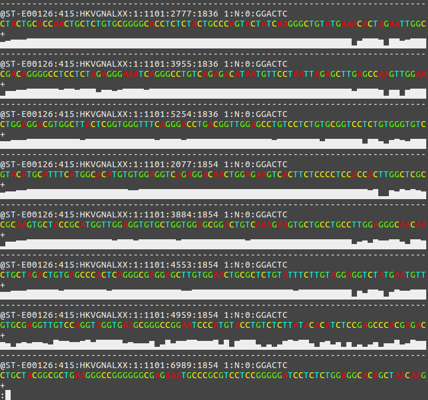
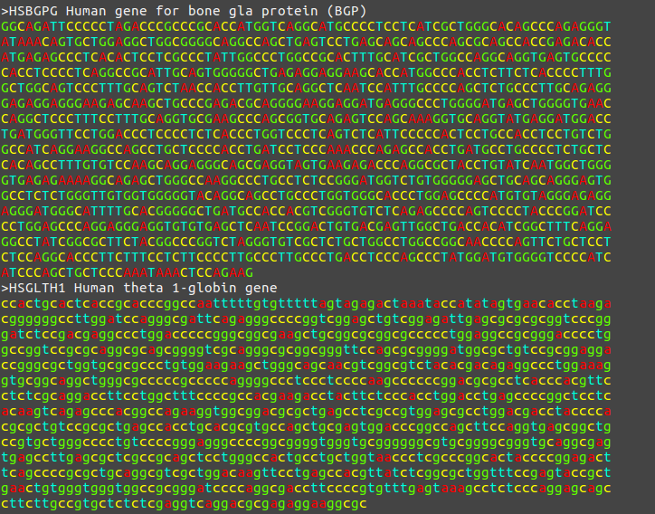
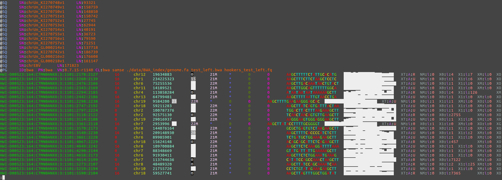
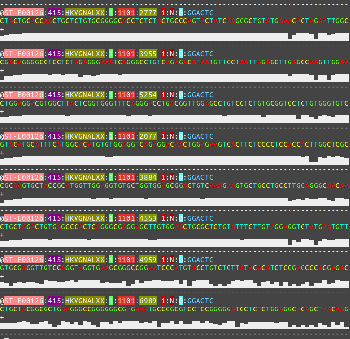
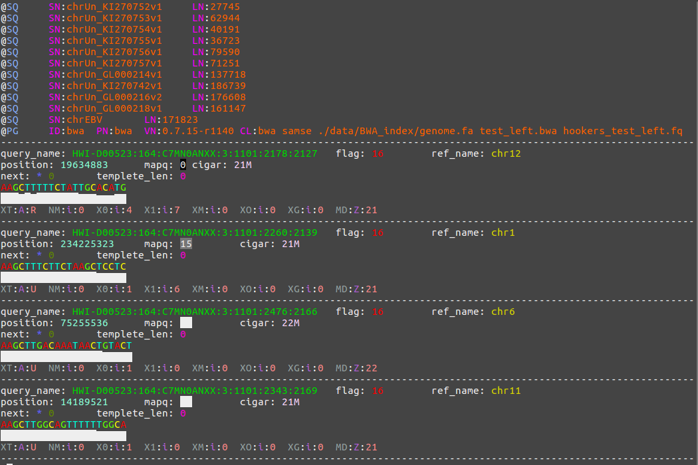
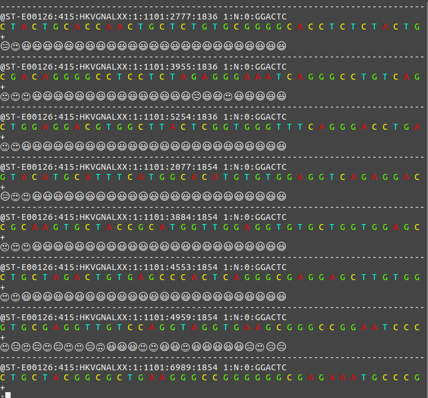
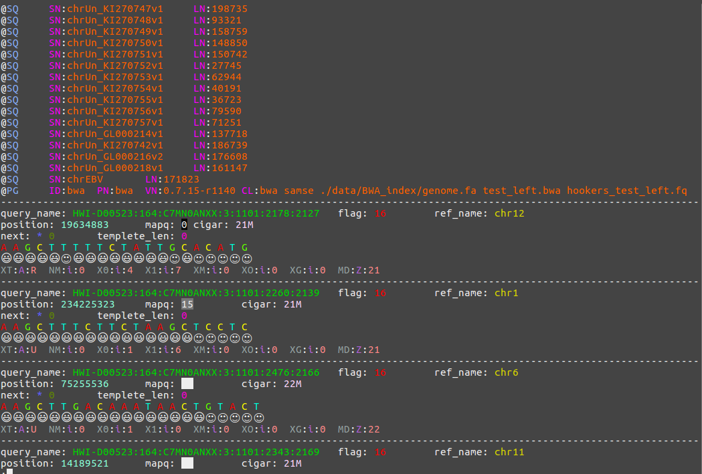

# Themes

## Simple (default)

Use the following command switch to this theme.

```bash
$ mkdir -p ~/.config/bioview/ ; curl -LJ https://raw.githubusercontent.com/Nanguage/bioView/master/theme/simple.json -o ~/.config/bioview/config.json
```

### glimpse

#### Fastq



#### Fasta



#### Sam



## Verbose

```bash
$ mkdir -p ~/.config/bioview/ ; curl -LJ https://raw.githubusercontent.com/Nanguage/bioView/master/theme/verbose.json n -o ~/.config/bioview/config.json
```

### glimpse

#### Fastq



#### Fasta

Same to Simple.

#### Sam



## Emoji

```bash
$ mkdir -p ~/.config/bioview/ ; curl -LJ https://raw.githubusercontent.com/Nanguage/bioView/master/theme/emoji.json -o ~/.config/bioview/config.json
```

### glimpse

#### Fastq



#### Fasta

Same to Simple.

#### Sam


